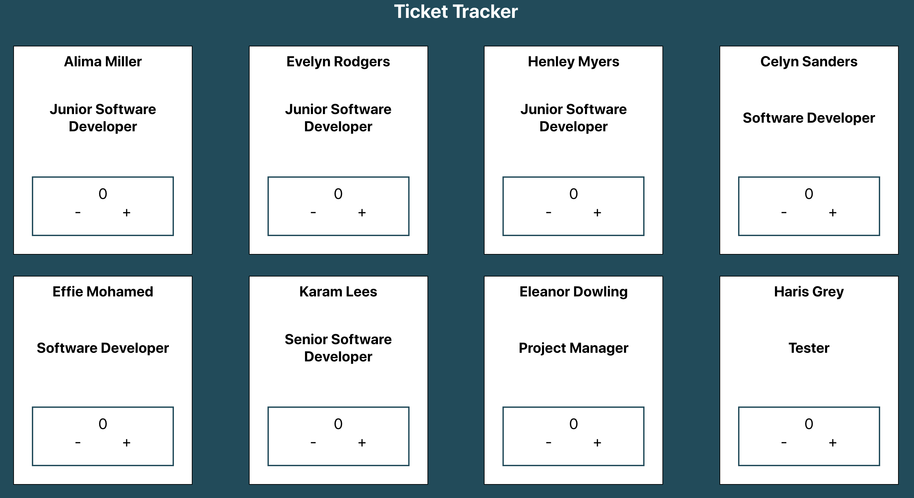

# Ticket Tracking System

This is a web app that allows you to track the number of project tickets different employees within a company have completed. You can also increase or decrease the number for each employee if the situation changes. This was a paired programming task completed alongside two of my colleagues on the _nology bootcamp.

## Technologies Used

- HTML
- CSS 
- SCSS
- Vanilla JS
- React

